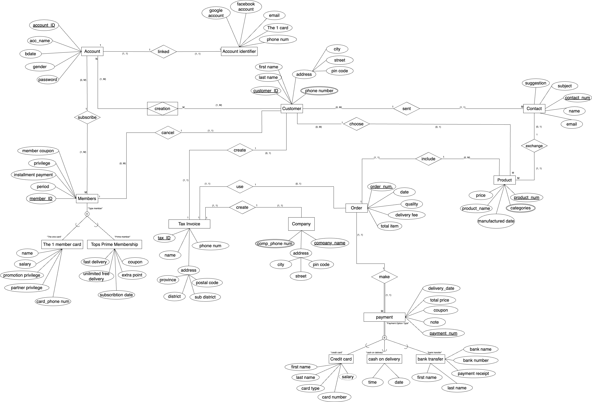
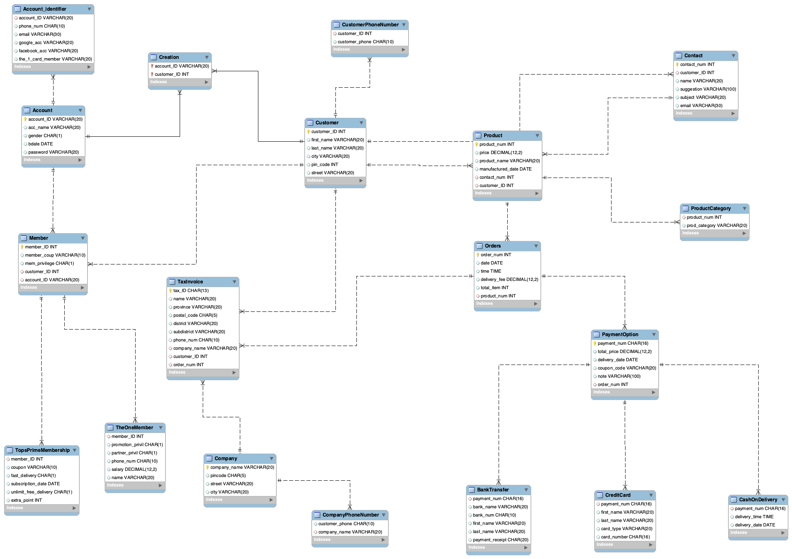

# Retail Database Design (TOPS Case Study)

This project focuses on designing a database system for a retail business (TOPS), including business processes, data modeling, and SQL implementation.

## Objectives
- Analyze business processes
- Design ER Diagram
- Create relational schema
- Apply normalization (1NF, 2NF, 3NF)
- Write SQL queries

## Tools
- MySQL
- SQL

## Project Contents
- ER Diagram
- Relational Schema
- SQL Scripts

## ER Diagram

## Contribution
This was a group project where tasks were shared across all members.

My contributions:
- Contributed to ER Diagram design
- Helped create relational schema
- Assisted in normalization
- Wrote and tested SQL queries
